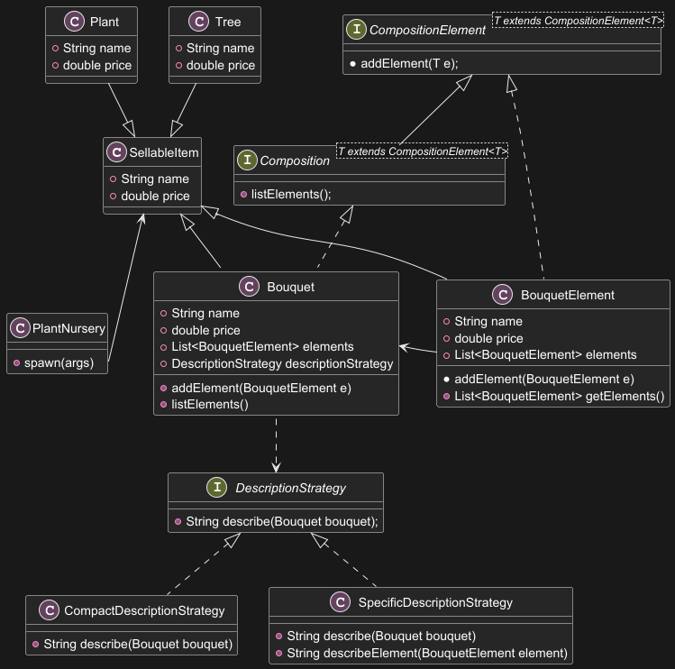

# FlowerShop

**FlowerShop** is a Java SE application built to emulate the management functionalities of a flower shop dedicated software. It was built with the idea of showcasing various OOP and Java related design patterns and functionalities.

---

## 🎯 Project Objective

The goal of this project is to develop a well-structured, secure, and maintainable application that demonstrates:

The effective use of object-oriented programming (OOP) principles.
The proper implementation of design patterns.
Proficiency in leveraging core Java technologies.
Special emphasis is placed on code security and robust exception handling.

---

## 🥇 Achieved Requirements

### **Mandatory Design Patterns (16 points)**

1. **Factory**
    - **Implementation**: The `PlantNursery` class handles the creation of various types of inventory items that the store would later sell.
    - **Usage**: The overloaded method `spawn()` is used to decide which specific `SellableItem` (`Plant`, `Tree`, or `Bouquet`) to instantiate and return.

2. **Composite** 
    - **Implementation**: `Bouquet` instances are built using the Composite pattern. 
    - **Usage**: The `Bouquet` instance acts as the "Composite" node, capable of holding various `BouquetElement` instances ("Leaf" components, representing individual items within a bouquet) together. In the current implementation the price of each element will determine the price of the composed item.  

3. **Iterator** 
    - **Implementation**: The `Cart` class has a nested inner class `CartIterator` that maintains its own index to traverse the items list within the Cart.
    - **Usage**: The `CartService` class uses  the `getIterator()` method to display the cart's items without needing to know how `Cart` stores its items. Similarly, The `Shop` class also uses `getIterator()` in its `checkout()` method to iterate through items in the cart.

4. **Exception Shielding**
    - **Implementation**: `UnrecognizedBouquetSizeException` and `UnrecognizedItemCreationRequestException` ensure robust exception handling during the `SellableItem` construction.
    - **Usage**: All exceptions are caught and shielded to prevent crashes or visible stack traces.

---

### **Mandatory Design Patterns (16 points)**

1. **Collections Framework**
    - **Implementation**: `List` and `Map` are widely used throughout the application.
    - **Example**: `Cart` items are in an `ArrayList`, `Inventory`'s stock is in a `HashMap`.

2. **Generics**
    - **Implementation**: Generics are employed to write flexible code, particularly for collections.
    - **Example**: Almost every instance of `HashMap` or `ArrayList` are created through the use of generics.

3. **Java I/O**
    - **Implementation**: The user is forced to use I/O to interact with the application.
    - **Example**: Depending on the input inserted the application returns a visible output. In case of errors a log file is written.

4. **Logging**
    - **Implementation**: Advanced logging is provided by the `UniversalLogger` and `CustomLogger` classes.
    - **Example**: The system logs significant events such as game restarts and timer endings.

5. **JUnit Testing**
    - **Implementation**: Some unit tests are present, in particular to analyze the correct functioning of the `PlantNursery` creation methods.
    - **Example**: Tests check if inputs are correctly sanitized and the correct creation of instances based on such inputs. They also test if the correct exceptions are launched.

---

### **Security Requirements**

All the requirements have been satisfied: Exceptions are correctly managed, no private data is hardcoded, user input is sanitized or properly watched.

---

## 🥇 Optional Advanced Features

### **Design Patterns**

1. **Singleton (2 pts)**
    - **Implementation**: Various classes are designed as singleton, to ensure that only one instance of them can be created. They have a private constructor that is used only in case the instance is not already been created
    - **Example**: `ApplicationMenu`, `Inventory`, `InventoryService` and `UniversalLogger` were created using this pattern.

2. **Strategy (4 pts)**
    - **Implementation**: A DescriptionStrategy is used to make a bouquet description interchangeable through switching to the preferred strategy.
    - **Example**: `CompactDescriptionStrategy` and `SpecificDescriptionStrategy ` are used to retrieve different information of the same instance.

3. **Chain of Responsibility (4 pts)**
    - **Implementation**: This pattern has been implemented for discount management purposes.
    - **Example**: The abstract class `DiscountHandler` defines the `setNext()` and `applyDiscount()` methods, and roughly defines the `handle()` method that will be used by `RegularPaymentHandler`, `BulkDiscountHandler`, and `BigOrderDiscountHandler` classes, each in its own way if the requirement is respected. The `handle()` method is made with the intent of finding the proper handler to satisfy each case.

4. **Template Method (3 pts)**
    - **Implementation**: The `Shop` abstract class contains the `checkout()` method (template) that represents the root of an item removal algorithm, but delegates the implementation of some steps to subclasses.
    - **Example**: `FlowerShop` is the concrete class that defines the `calculateTotal()` method, providing the specific logic that is needed to complete the method required steps, it's a customized implementation that doesn't alter the main structure of the algorithm.

---

### **Advanced Technologies**

1. **Stream API & Lambdas (5 pts)**
    - **Implementation**: The use of the `Stream API & Lambdas` are used in various parts of the code, to provide a fluent and functional-style way to process collections of data.
    - **Example**: They are used to convert a map keyset into an ordered list, to execute a method for each element of the Stream, to dynamically construct a string representing an instance's properties, and so on...

2. **Reflection (4 pts)**
    - **Implementation**: It is used to programmatically find and inspect the `stockMap` field based on its annotation. 
    - **Example**: In the `Inventory` class, reflection is applied within the `logStockStatus()` method through the use of the custom annotation `@Stockfield`. 

3. **Custom Annotations (2 pts)**
    - **Implementation**: The aforementioned `@Stockfield` custom annotation is implemented to mark a field that needs to be accessible. 
    - **Example**: Its use is needed to notify the user if an item actually has a low stock. 

4. **Inversion of Control (5 pts)**
    - **Implementation**: The `IoC` is implemented throughout the application with the use of the `Service Locator` pattern, a form of `IoC` less flexible than the `Dependency Injection`. Also it's correctly applied with the `FlowerShop` and `CartService` creation and management in the `ApplicationMenu` class.
    - **Example**: The use of `Singletons` with `getInstance()` methods is a form of `Service Locator` pattern, actually used in all the singleton aforementioned classes (`ApplicationMenu`, `Inventory`, `InventoryService` and `UniversalLogger`). Also IoC is expressed in `ApplicationMenu`, that constructs a `Shop` and a `CartService` entities it its constructor, passing them their own dependencies while constructing them. 

---

## 🔨 Setup

### **Requisites**
- **Java SE 21+**

---

## 📖 UML Diagrams

### Class Architecture

---
### Item Creation Structure

#

